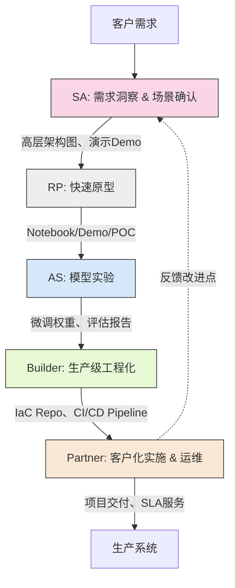
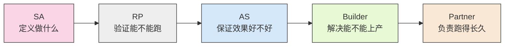
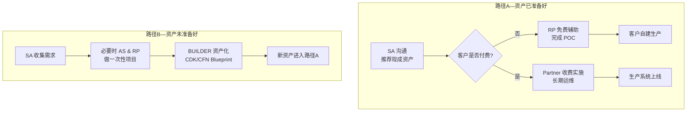
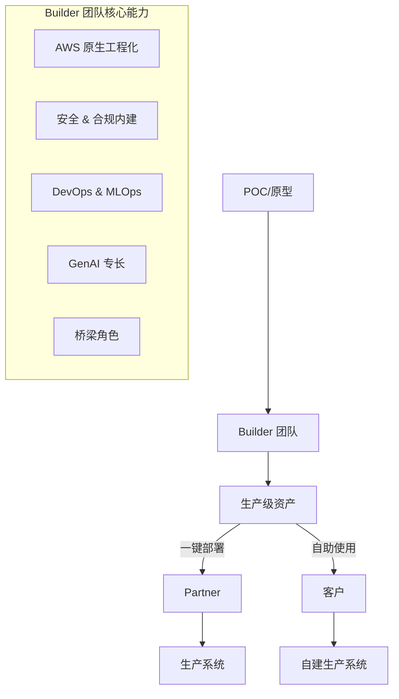

# AWS GenAI 解决方案交付团队与流程图

## 1. 团队协作全流程图

## 2. 团队定位与协同逻辑

## 3. 推荐业务流程路径

## 4. Builder 团队价值流程图

## 流程说明

### 团队定位与协同

1. **SA (Solutions Architect)**：定义"做什么"

   - 核心职责：梳理业务痛点、勾勒 AWS 服务组合、给出 ROI 预估
   - 典型交付物：高层架构图、演示 Demo
   - 交接内容：明确成功标准 & 测试账号

2. **RP (Rapid Prototyping)**：验证"能不能跑"

   - 核心职责：在测试账号中 1–2 周完成端到端 POC
   - 典型交付物：Notebook / 单实例 Demo / POC Prototype
   - 交接内容：记录模型 & 数据缺口

3. **AS (Applied Scientist)**：保证"效果好不好"

   - 核心职责：数据标注、微调/蒸馏、模型评估
   - 典型交付物：微调权重、评估报告、Model Card
   - 交接内容：推理配置 & 指标

4. **Builder (Solutions Engineering)**：解决"能不能上产"

   - 核心职责：基于 AWS IaC 的可复用蓝图，内置安全运维实践
   - 典型交付物：IaC Repo、CI/CD Pipeline、操作手册
   - 交接内容：可直接 Fork 的生产级资产

5. **Partner**：负责"跑得长久"
   - 核心职责：生产环境部署、客户化开发、长期维护
   - 典型交付物：项目交付、SLA 服务
   - 交接内容：反馈改进点给 SA & Builder

### 推荐业务流程路径

#### 路径 A（资产已准备好）

- 适用于 Builder 团队已为特定 GenAI 场景或技术栈准备了现成的 IaC 资产
- SA 发现客户需求与现有资产匹配时，直接推荐并演示这些资产
- 流程根据客户的付费意愿分叉：
  - **客户不付费**：RP 团队基于 Builder 提供的免费原型级别资产，在测试账号中快速完成 POC 演示，客户后续自行进行工程化工作
  - **客户愿意付费**：引入 Partner 团队，基于 Builder 提供的生产级资产进行客户化实施和长期运维

#### 路径 B（资产未准备好）

- 适用于 SA 发现了新的、现有 Builder 资产未能覆盖的创新性需求
- SA 收集详细需求后，必要时召集 AS 和 RP 团队，以一次性项目形式验证技术可行性并构建初步原型
- 验证成功后，Builder 团队将一次性项目成果进行资产化，转化为生产级标准的 IaC 蓝图
- 新建资产纳入 Builder 的资产库，回流到路径 A，形成资产积累和复用的良性循环
